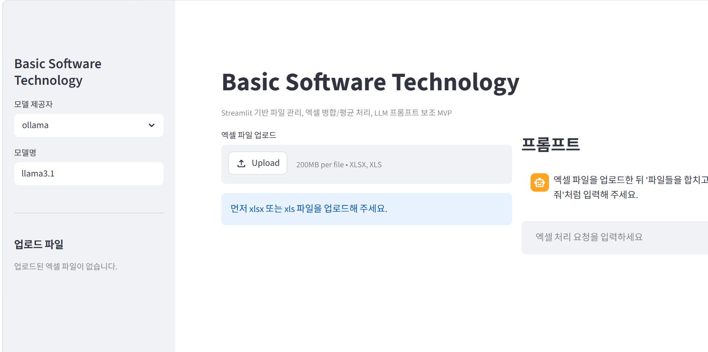
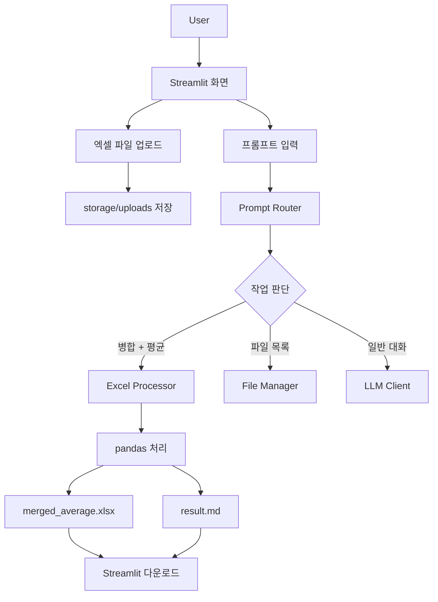

# Basic Software Technology

Streamlit 기반의 엑셀 파일 업로드, 파일 관리, 프롬프트 실행, 결과 저장 MVP입니다.
사용자가 엑셀 파일을 업로드하고 자연어로 처리 요청을 입력하면, 앱은 요청을 안전한 내부 작업으로 라우팅한 뒤 pandas 기반 엑셀 처리를 수행합니다.

## Project Status

| 항목 | 상태 | 비고 |
|---|---|---|
| GitHub 업로드 | 완료 | `main` 브랜치 기준 |
| Streamlit UI | 완료 | 파일 업로드, 미리보기, 채팅 입력 |
| 엑셀 처리 | 완료 | 병합, 동일 항목 평균 계산, xlsx/md 저장 |
| 실행 화면 캡처 | 완료 | `docs/screenshot-main.png` |
| 원격 서버 실행 | 완료 | SSH 접속 후 서버에서 Streamlit 실행 확인 |
| SheetPilot 참고 관계 정리 | 완료 | README 비교표 포함 |
| AI Agent/Skill 개념 연계 | 완료 | README 별도 섹션 포함 |
| 시연 가이드 | 완료 | `docs/demo-recording-guide.md` 참고 |

## 실행 화면



## 시연 영상

시연 영상은 원격 서버에서 실행 중인 Streamlit 앱의 동작을 보여주는 용도로 구성합니다.
영상에는 아래 흐름을 포함합니다.

1. GitHub README 확인
2. PowerShell에서 SSH 터널 접속
3. 브라우저에서 터널링된 로컬 앱 주소 접속
4. Streamlit 앱 실행 화면 확인
5. 엑셀 파일 업로드, 미리보기, 프롬프트 입력
6. 결과 xlsx/md 다운로드 버튼 확인

자세한 촬영 순서는 [docs/demo-recording-guide.md](docs/demo-recording-guide.md)에 정리했습니다.

## 원격 서버 실행 확인

2026-05-18에 회사 원격 서버에서 프로젝트를 clone하고 Streamlit 실행까지 확인했습니다.

| 항목 | 내용 |
|---|---|
| 접속 방식 | SSH |
| 접속 호스트 | 보안상 비공개 |
| SSH 포트 | 보안상 비공개 |
| 서버 계정 | 보안상 비공개 |
| 서버 OS | Ubuntu 22.04.5 LTS |
| Python 환경 | Python 3.10 가상환경 `.venv` |
| 실행 포트 | 보안상 비공개 |
| 확인 방식 | SSH 터널 후 노트북 브라우저에서 접속 확인 |

서버에서 실제 수행한 주요 명령은 다음과 같습니다.

```bash
ssh <SSH_USER>@<SSH_HOST> -p <SSH_PORT>
git clone https://github.com/dhkimaru/Basic-Software-Technology.git
cd Basic-Software-Technology
python3 -m venv .venv
source .venv/bin/activate
pip install -r requirements.txt
streamlit run app.py --server.address <BIND_ADDRESS> --server.port <APP_PORT>
```

서버 실행 결과:

```text
Uvicorn server started on <BIND_ADDRESS>:<APP_PORT>

You can now view your Streamlit app in your browser.

Local URL: http://localhost:<APP_PORT>
Network URL: http://<PRIVATE_NETWORK_IP>:<APP_PORT>
External URL: http://<PUBLIC_SERVER_IP>:<APP_PORT>
```

외부 포트가 직접 열려 있지 않은 환경에서는 아래처럼 SSH 터널을 사용해 로컬 브라우저에서 서버 앱을 확인했습니다.

```powershell
ssh -L <LOCAL_PORT>:localhost:<APP_PORT> <SSH_USER>@<SSH_HOST> -p <SSH_PORT>
```

자세한 수행 기록은 [docs/remote-run-log.md](docs/remote-run-log.md)에 정리했습니다.

## 구현 목표

- Streamlit 기반 대화형 프롬프트 UI
- 엑셀 파일 업로드, 목록 확인, 미리보기, 삭제
- 업로드된 여러 엑셀 파일 병합
- 동일 항목 기준 숫자 컬럼 평균 계산
- 결과 엑셀 파일과 Markdown 처리 결과 저장
- Ollama, OpenAI, Gemini 호출 구조 제공

## 참고 프로젝트

이 프로젝트는 [SheetPilot](https://github.com/prof-lijar/sheetpilot)의 방향성을 기준 및 참고했습니다.

SheetPilot의 핵심 구조는 Streamlit UI, Ollama 기반 LLM 실행, Excel/CSV 파일 관리, 자연어 프롬프트 기반 데이터 처리, Markdown export입니다. 본 프로젝트도 같은 문제 영역인 “프롬프트 기반 엑셀 처리 워크벤치”를 다루지만, 초기 MVP에서는 LLM이 생성한 코드를 직접 실행하지 않고, 프롬프트를 사전에 정의한 안전한 처리 함수로 연결하는 방식을 선택했습니다.

| 구분 | SheetPilot | Basic Software Technology |
|---|---|---|
| UI | Streamlit | Streamlit |
| 파일 처리 | Excel/CSV 업로드, 미리보기, 삭제 | xlsx/xls 업로드, 미리보기, 삭제 |
| LLM | Ollama 중심 | Ollama/OpenAI/Gemini 호출 골격 |
| 프롬프트 처리 | LLM이 pandas 코드를 생성하고 수동 실행 | 프롬프트를 안전한 작업명으로 라우팅 |
| 실행 방식 | sandboxed code execution | 사전 구현 함수 실행 |
| 결과 저장 | Excel/CSV, Markdown | xlsx, Markdown |

## 시스템 흐름



## 주요 기능

- **Interactive Prompt**: `st.chat_input`, `st.chat_message` 기반 대화형 입력
- **File Management**: 파일 업로드, 서버 폴더 저장, 목록 조회, 삭제
- **Excel Preview**: 업로드된 엑셀 파일의 시트, 행 수, 컬럼, 상위 데이터 확인
- **Excel Merge/Average**: 여러 엑셀 파일을 `비용명`, `항목명`, `표항목` 등 기준 컬럼으로 그룹화하고 숫자 컬럼 평균 계산
- **Result Export**: 처리 결과를 `merged_average.xlsx`, `result.md`로 저장
- **LLM Client Structure**: Ollama, OpenAI, Gemini 호출 모듈 분리

## 프로젝트 구조

```text
Basic-Software-Technology/
├── app.py
├── modules/
│   ├── file_manager.py
│   ├── excel_processor.py
│   ├── prompt_router.py
│   ├── llm_client.py
│   └── markdown_writer.py
├── storage/
│   ├── uploads/
│   ├── outputs/
│   └── logs/
├── docs/
│   ├── screenshot-main.png
│   └── demo.png
├── requirements.txt
└── README.md
```

## AI Agent / Skill 개념 연계

Codex와 Claude Code 같은 AI coding agent는 앱의 런타임 구성요소가 아니라, 소프트웨어 개발 과정에서 작업을 분석하고 구현 단위를 나누는 개발 도구로 분류할 수 있습니다. 본 프로젝트에서는 이 개념을 앱 구조에 직접 대입해, 자연어 요청을 바로 코드 실행으로 연결하지 않고 “분석 가능한 작업 단위”로 분리하는 방향을 적용했습니다.

Skill은 반복 가능한 작업 절차를 정의한 단위로 해석할 수 있습니다. 이 프로젝트에서는 엑셀 처리 업무를 다음과 같은 skill 관점으로 나누어 설계했습니다.

| Skill 관점 | 본 프로젝트와의 연결 |
|---|---|
| 파일 분석 skill | 업로드된 엑셀 파일의 시트, 컬럼, 행 구조 확인 |
| 프롬프트 라우팅 skill | 자연어 요청을 `merge_excel_average`, `list_files` 같은 안전한 작업으로 변환 |
| 엑셀 처리 skill | pandas 기반 병합, 평균, 결과 파일 저장 |
| 문서화 skill | README, 실행 화면 캡처, flowchart를 통한 결과 설명 |
| 배포/검증 skill | Streamlit 실행, 원격 서버 실행, 실행 결과 확인 |

즉, 본 프로젝트에서의 핵심은 AI agent 자체를 서비스에 포함하는 것이 아니라, agent/skill의 사고방식처럼 복잡한 요청을 작은 작업 흐름으로 분해하고, 그중 안전하게 자동화 가능한 부분을 Streamlit 서비스로 구현하는 것입니다.

## 실행 방법

### Windows 로컬 실행

```powershell
python -m venv .venv
.\.venv\Scripts\Activate.ps1
pip install -r requirements.txt
Copy-Item .env.example .env
streamlit run app.py
```

브라우저에서 다음 주소로 접속합니다.

```text
http://localhost:<LOCAL_PORT>
```

### Linux / 원격 서버 실행

```bash
python3 -m venv .venv
source .venv/bin/activate
pip install -r requirements.txt
streamlit run app.py --server.address <BIND_ADDRESS> --server.port <APP_PORT>
```

외부 포트 접근이 막힌 서버에서는 PowerShell에서 SSH 터널을 열고 브라우저로 접속합니다.

```powershell
ssh -L <LOCAL_PORT>:localhost:<APP_PORT> <SSH_USER>@<SSH_HOST> -p <SSH_PORT>
```

```text
http://localhost:<LOCAL_PORT>
```

## Ollama 사용

Ollama가 설치되어 있다면 모델을 받은 뒤 앱에서 제공자를 `ollama`로 선택합니다.

```powershell
ollama pull llama3.1
ollama serve
```

## 프롬프트 예시

```text
업로드된 엑셀 파일들을 하나로 합치고 동일 항목은 평균으로 계산해줘
```

내부 처리 흐름은 다음과 같습니다.

1. 업로드 폴더의 엑셀 파일 목록 확인
2. 각 파일의 첫 번째 시트 읽기
3. 병합 헤더가 있는 예실대비표 형식이면 2줄 헤더를 평탄화
4. 기준 컬럼 선택
5. 숫자 컬럼 평균 계산
6. 결과 xlsx와 md 파일 저장

## 보안 설계

초기 MVP에서는 AI가 생성한 코드를 바로 실행하지 않습니다.
사용자의 프롬프트는 `prompt_router.py`에서 정해진 작업명으로만 변환되고, 실제 실행은 사전에 구현된 함수만 수행합니다.

이 방식은 다음 위험을 줄이기 위한 선택입니다.

- 임의 Python 코드 실행
- 서버 파일 삭제
- 외부 명령 실행
- 민감 파일 접근

## 현재 구현 범위와 제외 범위

현재 최종본은 Streamlit 기반 파일 관리, 엑셀 처리, 프롬프트 라우팅, 결과 저장, 원격 서버 실행 확인까지 수행했습니다.

원격 RTX 5090 서버에 접속해 앱 실행은 확인했지만, GPU 자원을 사용하는 Ollama 모델 실행 및 Spark 연동은 이번 MVP 범위에서는 실제 활성화하지 않았습니다. 이 두 항목은 서버의 GPU 드라이버, Ollama 설치 상태, Spark 실행 환경 확인이 추가로 필요하기 때문에 향후 확장 항목으로 분리했습니다.

## 향후 확장

- 사용자별 업로드 파일 분리
- 작업 이력 저장
- OpenAI/Gemini 응답을 활용한 더 정교한 작업 분류
- 원격 GPU 서버에서 Ollama 모델 실행 확인
- 대용량 데이터 처리를 위한 Spark 연동
